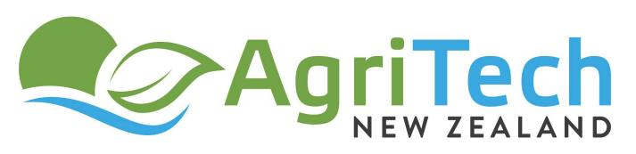

# Contact Us

The Farm Data glossaries and data dictionaries are maintained on behalf of [AgriTech New Zealand](https://agritechnz.org.nz/) and the New Zealand primary sector.

The current maintainer is **Map of Agriculture NZ Limited (Rezare Systems)**

* 3 Melody Lane, Waikato Innovation Park, Hamilton, New Zealand. Telephone +64 7 857 0820

* Visit [www.mapof.ag](https://mapof.ag/contact/)
