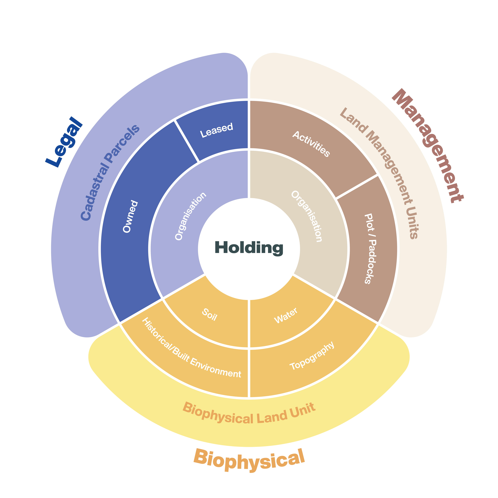

<h1 style="text-align:center; width:100%;">Overview</h1>

<h2> Spatial feature layers </h2>

The figure below shows how spatial features may occupy similar spatial area while not being completely related.

<a href="https://www.datalinker.org/activity" class="btn" style="align-items:center">View Data Glossary</a>
<a href="https://github.com/Datalinker-Org/Farm-Data-Standards/blob/master/README.md" class="btn" style="align-items:center; margin-left:0;">View the Farm Data Standards</a>

<h2> Non-spatial features relationship </h2>

The figure below shows how spatial entities have relationship with Non-spatial entities.

