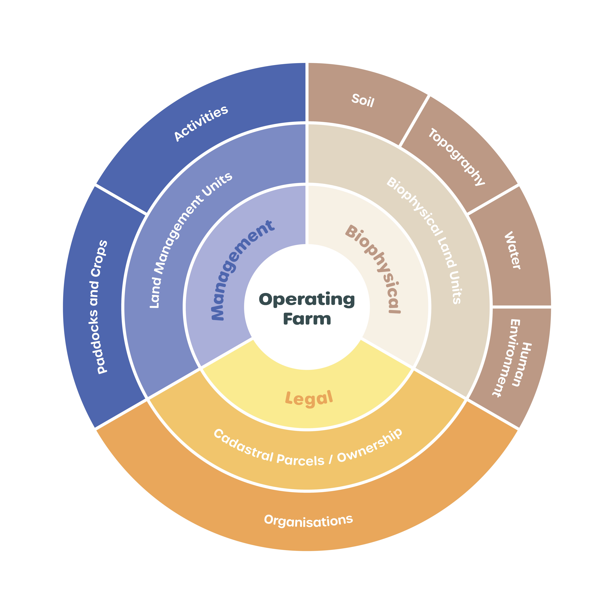
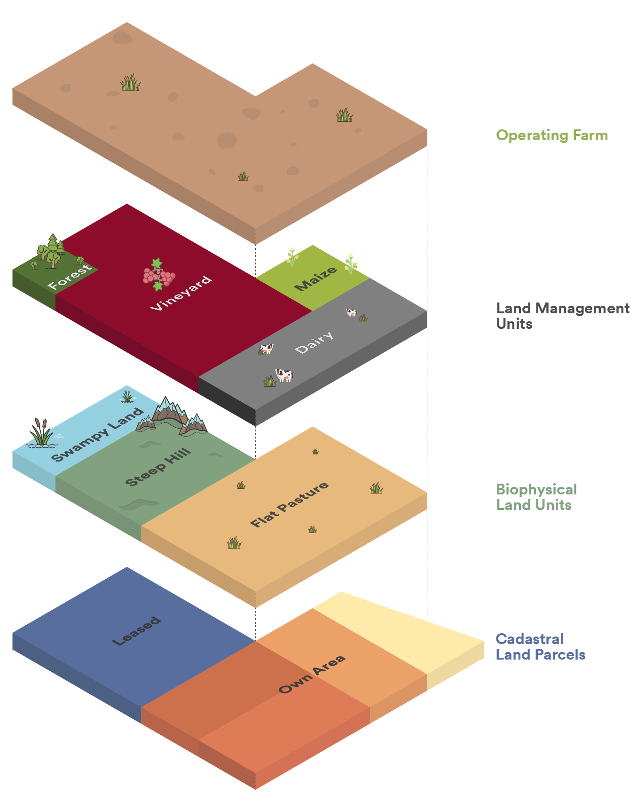

# Glossaries and Data Dictionaries for Farm Data

Often referred to as the New Zealand Farm Data Standards, these pages contain glossaries and data dictionaries for describing farm data. You can use these definitions when designing applications and databases, and to support interoperability between different systems. There are two complementary sets of data definitions:
1. **Common glossary:** A set of definitions for entities and data elements to support farm planning, freshwater farm plans, and discussions and planning around greenhouse gas emissions and climate adaptation. This glossary was originally compiled in 2023.
2. **Subject-area specific data dictionaries:** These were originally compiled between 2012 and 2016, and are maintained through GitHub pull requests by interested parties. Examples include livestock data, stock reconciliations, fertiliser and spray applications, and irrigation.

## Common Glossary Overview

<a href="https://www.datalinker.org/legal" class="btn" style="align-items:center">View the Common Glossary</a>

The common glossary is conceptually organised into the three interelated areas that define an operating farm system:
* **Biophysical** - a description of the soils, topography, hydrology, and historical and cultural human environments that help to understand the extent, capability, and inherent risks of the operating farm environment.
* **Legal** the cadastral land parcels, lease and operation agreements, organisations and people responsibilities that describe how a farm operation is defined and responsibilities within regulatory frameworks.
* **Management** the set of crops and enterprises, activities, operating procedures and management decisions that define the operation of a farm business within the legal and biophysical constraints. Some activities and decisions may mitigate inherent biophysical risks, while other decisions and activities may exacerbate existing risks or introduce new risks.

Figure 1: Conceptual organisation

You can also visualise data in a farm system as a set of overlapping spatial layers, all of which underpin or overlay the boundaries of an **operating farm**.
* **Cadastral land parcels** define the legal areas of land ownership or use.
* **Biophysical land units** are a conceptual integration of the topographic, hydrographic, soil and capability layers that make up the landscape, and are often categorised into areas of similar capability by land management specialists.
* **Land Management units** represent the decisions made by farmers and land managers about the activities, crops and enterprises that will be applied to land (including setting aside land areas for natural capital and biodiversity purposes, or for carbon capture).

Figure 2: Spatial layers

## Data Dictionaries Overview

Originally compiled as the New Zealand Farm Data Standards, but now used internationally, these data dictionaries compiled definitions for several key areas of farm management, and made use of existing regional and international data projects, including the [International Committee for Animal Recording](https://www.icar.org/) and the European [INSPIRE Geospatial Data Catalogue](https://inspire.ec.europa.eu/).
Originally developed in Microsoft Word and PDFs, the data dictionaries were converted to Markdown within GitHub respositories to facilitate maintenance and suggestions for improvement from the open source community. The data dictionaries are published as open source under the [Apache 2.0 Licence](https://github.com/Datalinker-Org/Farm-Data-Standards/blob/master/LICENSE).

<a href="https://github.com/Datalinker-Org/Farm-Data-Standards" class="btn" style="align-items:center">Farm Data Dictionaries in GitHub</a>

* [FAQ](https://github.com/Datalinker-Org/Farm-Data-Standards/blob/master/Information%20for%20Customers/FarmDataStandards_FAQ.md)
* [For Farmers](https://github.com/Datalinker-Org/Farm-Data-Standards/blob/master/Information%20for%20Customers/FarmDataStandards_For-Farmers.md)
* Farm Data Standards
  * [Animal Data Standard](https://github.com/Datalinker-Org/Farm-Data-Standards/blob/master/Animal%20Data%20Standards/README.md)
  * [Land Application Data Standard](https://github.com/Datalinker-Org/Farm-Data-Standards/blob/master/Land%20Application%20Standard/README.md)
  * [Financial Data Standard](https://github.com/Datalinker-Org/Farm-Data-Standards/blob/master/Financial%20Data%20Standard/README.md)
  * [Irrigation & Effluent Data Standard](https://github.com/Datalinker-Org/Farm-Data-Standards/blob/master/Irrigation%20and%20Effluent/README.md)
  * [Stock Reconciliation Data Standard](https://github.com/Datalinker-Org/Farm-Data-Standards/blob/master/Stock%20Reconciliation/README.md)
  * [Farm Feature & Attributes Data Standard](https://github.com/Datalinker-Org/Farm-Data-Standards/blob/master/Farm%20Features%20and%20Attributes/README.md)
  * [Pasture, Grazing & Feed Data Standard](https://github.com/Datalinker-Org/Farm-Data-Standards/blob/master/Pasture%20Graze%20and%20Feed/README.md)
  * [Farm Model Data Standard](https://github.com/Datalinker-Org/Farm-Data-Standards/blob/master/Farm%20Model/README.md)
  * [Health & Safety Data Standard](https://github.com/Datalinker-Org/Farm-Data-Standards/blob/master/Health%20and%20Safety/README.md)
* [Animal Breed List](https://github.com/Datalinker-Org/Farm-Data-Standards/blob/master/Additional%20Value%20Lists/FarmDataStandards_Animal-Breed-List.md)
* [Animal Feed List](https://github.com/Datalinker-Org/Farm-Data-Standards/blob/master/Additional%20Value%20Lists/FarmDataStandards_Animal-Feed-List.md)
* [URN Namespaces](https://github.com/Datalinker-Org/Farm-Data-Standards/blob/master/Information%20for%20Customers/FarmDataStandards_Namespaces-for-Farm-Data-Identifiers.md)